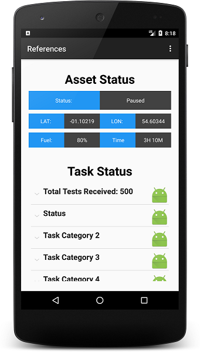

# Test Applications

Historical Android code from 2015 which includes UI designs I may use for inspiration in the future.

## Build Targets (27 November 2018)

1. Android Studio `3.2.1`
1. Target SDK Platform `Android 9 API 28`
1. Min SDK Platform `Android 4.2 API 17`

